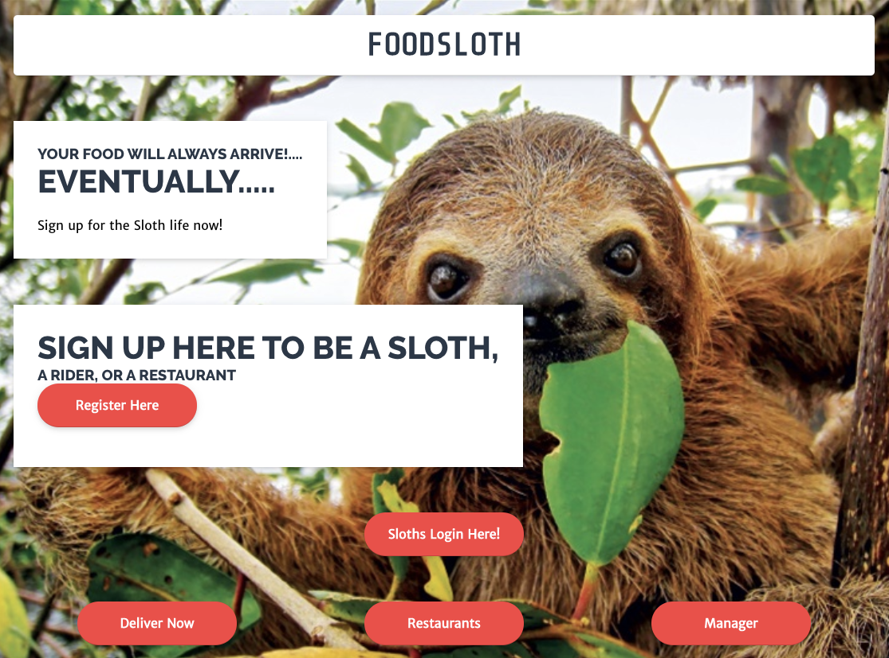
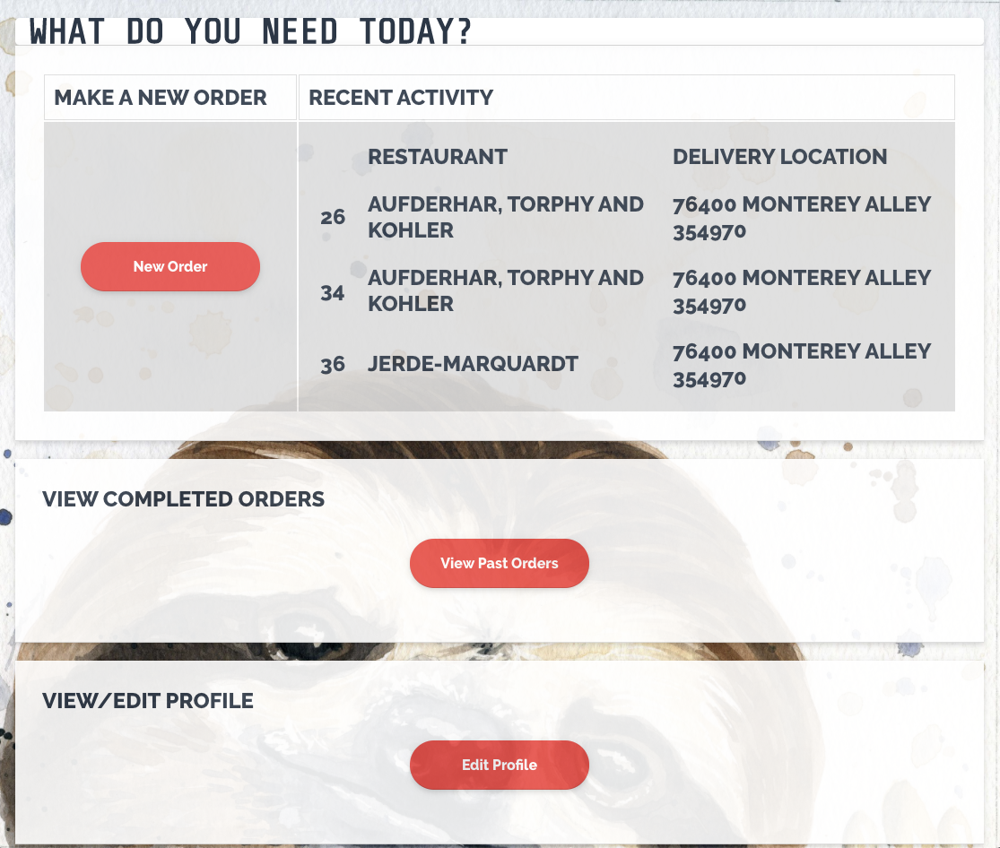
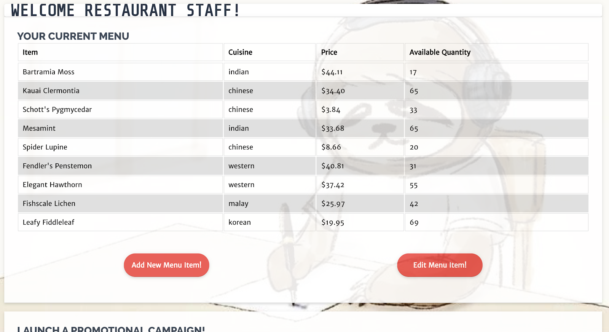

# FoodSloth

## Your food will always arrive!... eventually...

FoodSloth is a proof-of-concept food delivery web application written as part of CS2102 Database Systems at the National University of Singapore.

It uses Node.js and Pug for its frontend, and Node.js with Express for its backend. It uses PostgreSQL for its database.

It is written with a primary focus on demonstrating the capabilities of PostgreSQL. As such, data validation and logical checks that would usually be integrated in code have been adapted to run as SQL triggers instead.

## Installation guide
### Frontend
1. `git clone https://github.com/dawo5010/cs2102.git` to clone the repo
2. `npm install` to install relevant node modules
3. `npm install nodemon` to install nodemon
4. Execute by running `nodemon app.js`
5. Website is available on localhost:8000
    note: the website is not available unless `nodemon app.js` is executing

### Backend
1. Navigate to the backend folder
2. Duplicate the `settings_blank.js` file
3. Rename the duplicated file to `settings.js`
4. Fill in your SQL database login details in `settings.js`
5. `npm install` to install the relevant node modules
6. `npm install sql-template-strings`
7. `npm install nodemon` to install nodemon
8. Start server with `nodemon index.js`
9. Backend is available at localhost:8001
  
### Setting up localdatabase using postgresql for given queries.js file
1. Ensure that PostgreSQL is installed
2. Navigate to backend folder
3. Run the command: `psql postgres`
4. CREATE DATABASE project;
5. Run the command: `\c project`
6. Create tables using `sql/tables.sql`
7. [OPTIONAL] Insert default values for each table according to the numerical order specified in the filenames of each sql file in the `sql` folder
8. Follow step 2 - 4 of the Backend setup
9. Run command: `npm i express pg` to install Express for the server and node-postgres (pg) to be able to connect to PostgreSQL
10. Run command: `node index.js`, list of all users in json format available on http://localhost:8001/users

## Screenshots

### Login

### Customer Home

### Restaurant Home

